<div align="center">

# AITV LMS

### A production-grade Learning Management System built with React Native Expo

[](https://reactnative.dev)
[](https://expo.dev)
[](https://typescriptlang.org)
[](https://nativewind.dev)

</div>

---

## Table of Contents

- [Overview](#overview)
- [Screenshots](#screenshots)
- [Demo Video](#demo-video)
- [Features](#features)
- [Architecture](#architecture)
- [Tech Stack](#tech-stack)
- [Setup Instructions](#setup-instructions)
- [Environment Variables](#environment-variables)
- [Project Structure](#project-structure)
- [Key Architectural Decisions](#key-architectural-decisions)
- [API Reference](#api-reference)
- [Known Issues & Limitations](#known-issues--limitations)
- [Build Instructions](#build-instructions)

---

## Overview

AITV LMS is a full-featured mobile learning platform that demonstrates senior-level React Native engineering. It covers secure authentication, per-user data isolation, WebView bidirectional communication, offline resilience, push notifications, adaptive dark/light theming, and production-grade error handling — all built on top of the public [FreeAPI](https://api.freeapi.app) endpoints.

---

## Screenshots

> All screenshots taken on a physical Android device running Android 14.

### Authentication

| Login | Register |
|-------|----------|
| 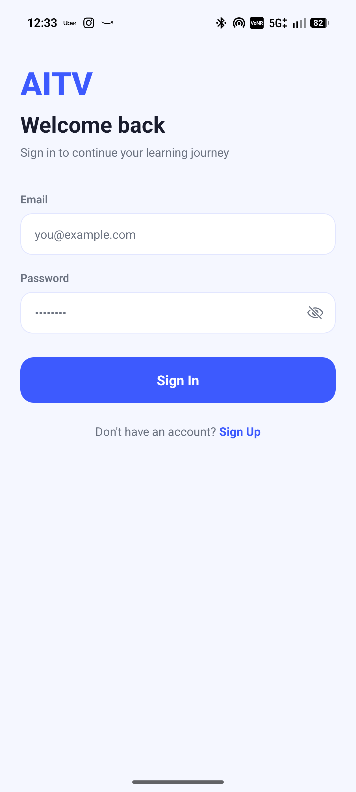 | 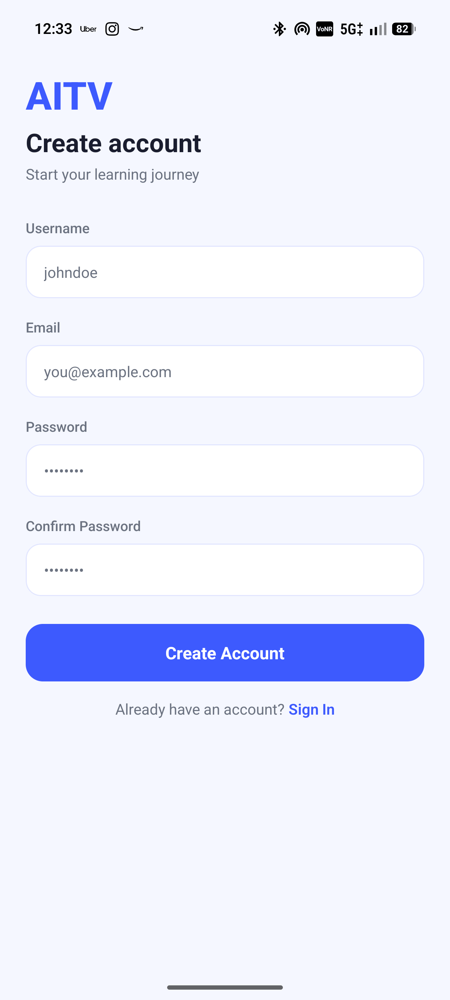 |

*Clean login with email/password. Eye icon toggles password visibility. Form validated with Zod — inline error messages appear immediately. No test credentials or guest bypass.*

---

### Home Screen

| Home — Light Mode | Home — Dark Mode |
|-------------------|-----------------|
| 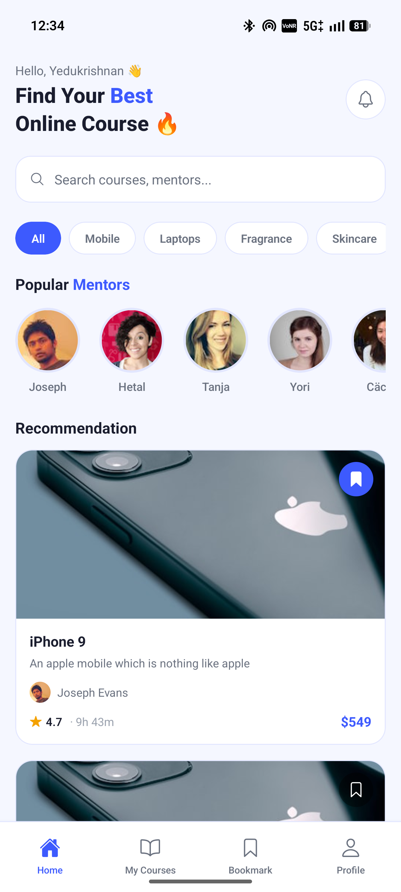 | 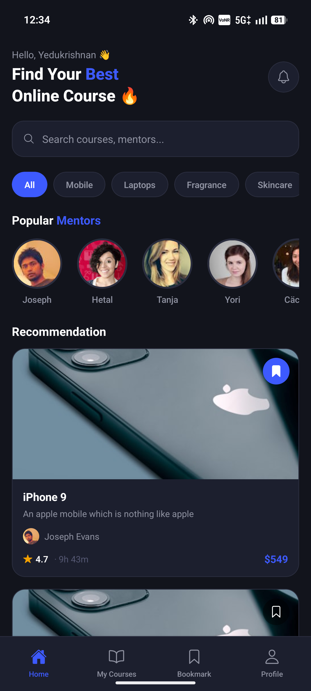 |

*Personalised greeting, search bar, category filter chips, Popular Mentors horizontal scroll (4 mentors), Recommendation feed. Pull-to-refresh active. Offline banner appears at top when network drops.*

---

### Course Browsing & Search

| Search Active | Category Filter |
|---------------|----------------|
|  | 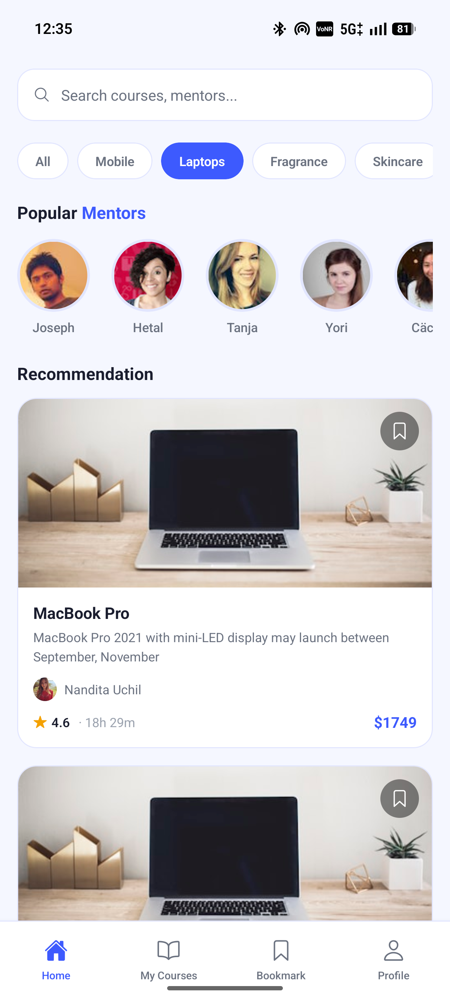 |

*Real-time client-side search across course titles and instructor names. Category chips filter by product type. Empty state shown when no results match.*

---

### Course Detail

| About Tab | Lessons Tab | Discussions Tab |
|-----------|-------------|-----------------|
| 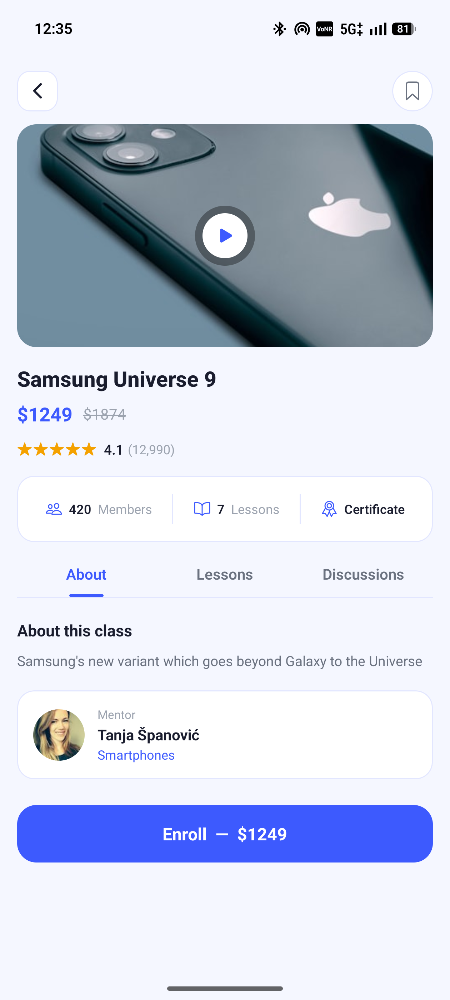 | 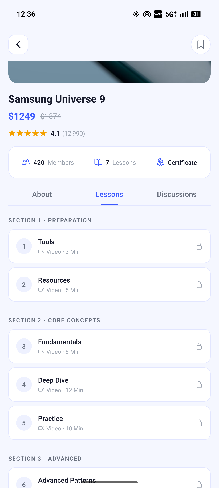 | 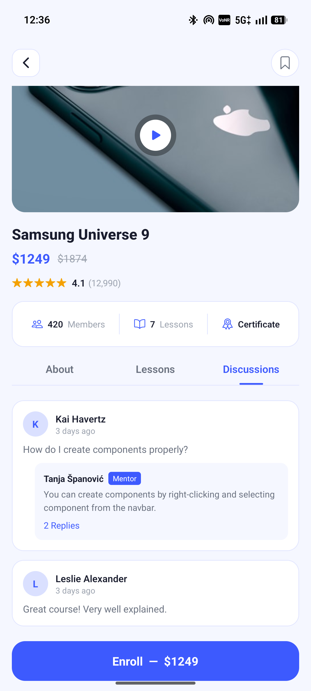 |

*Three-tab layout. About shows course description, price, rating (5-star), stats bar (Members / Courses / Certificate), and mentor card. Lessons tab shows structured sections with video duration and lock icon. Discussions shows threaded replies with mentor badge. Bookmark icon in header is live — updates Bookmarks tab instantly.*

---

### WebView Course Content

| WebView — Light | WebView — Dark |
|-----------------|---------------|
| 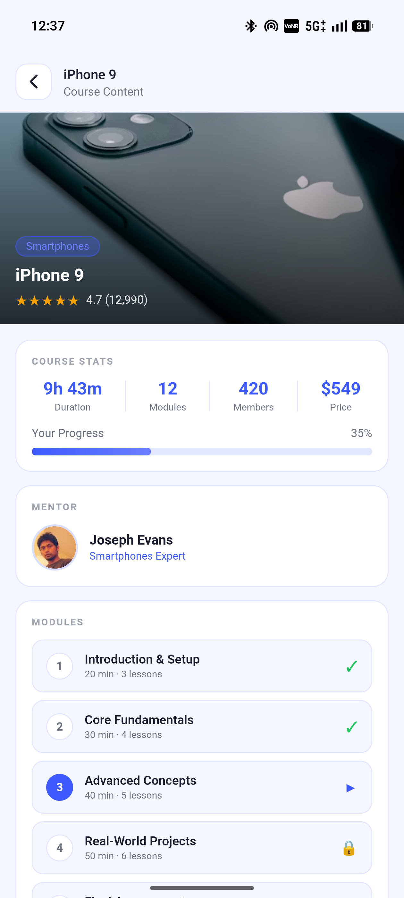 | 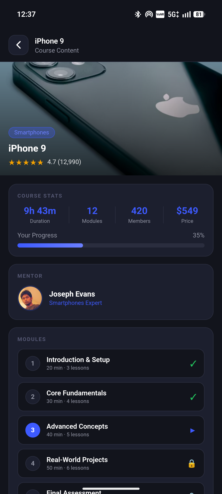 |

*Fully themed HTML page rendered inside `react-native-webview`. Shows course hero image, stats card, animated progress bar (35%), mentor card, and module list. Native app passes course data via injected JS headers (X-Course-ID, X-Course-Title, X-Platform). WebView posts messages back for "Continue Learning" and "Back" — handled natively.*

---

### Bookmarks

| Bookmarks — Populated | Bookmarks — Empty |
|----------------------|-------------------|
| 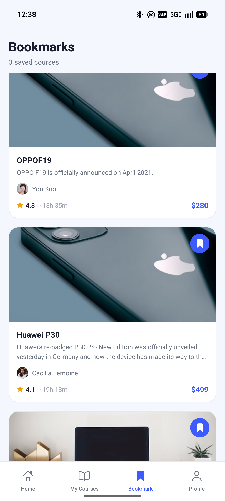 | 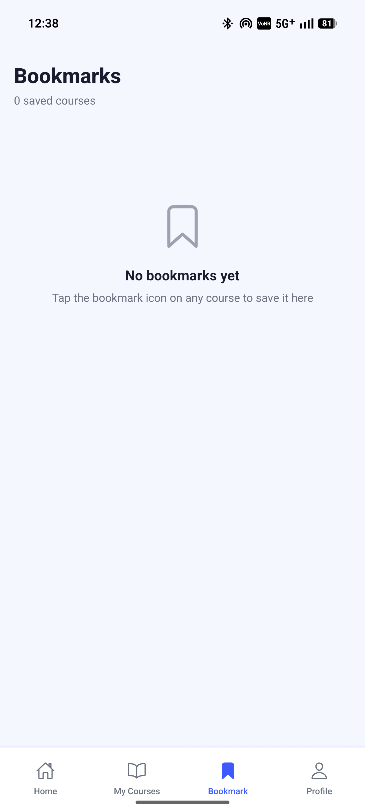 |

*Shows only courses the current user has bookmarked. Bookmark state updates instantly across all screens. Each user's bookmarks are stored under their own key — switching accounts shows a different list.*

---

### Profile

| Profile Screen | Edit Profile | Notification Settings |
|----------------|-------------|----------------------|
| 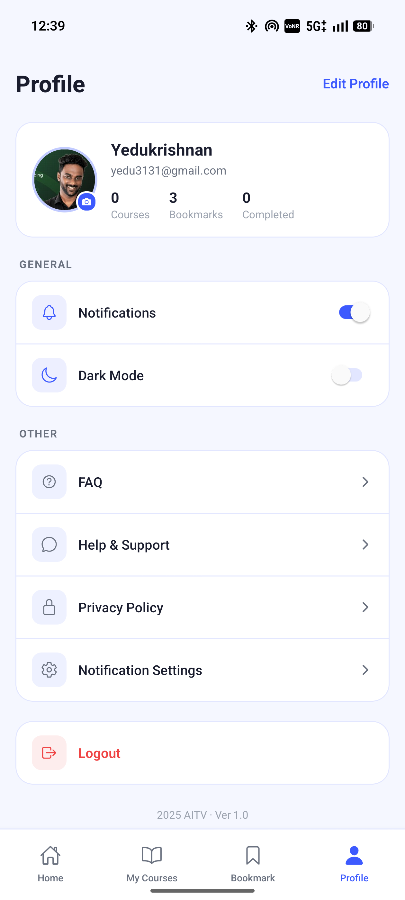 | 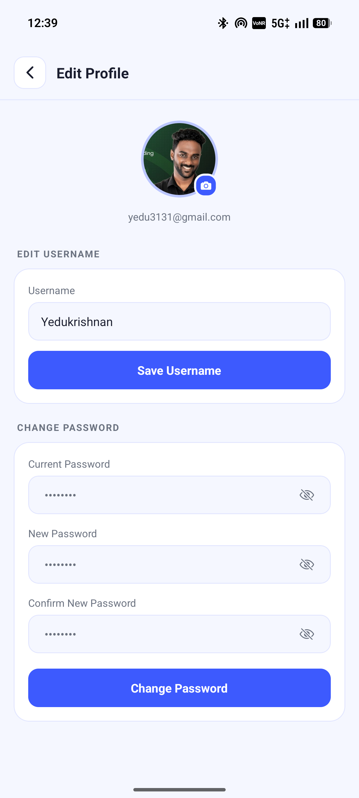 | 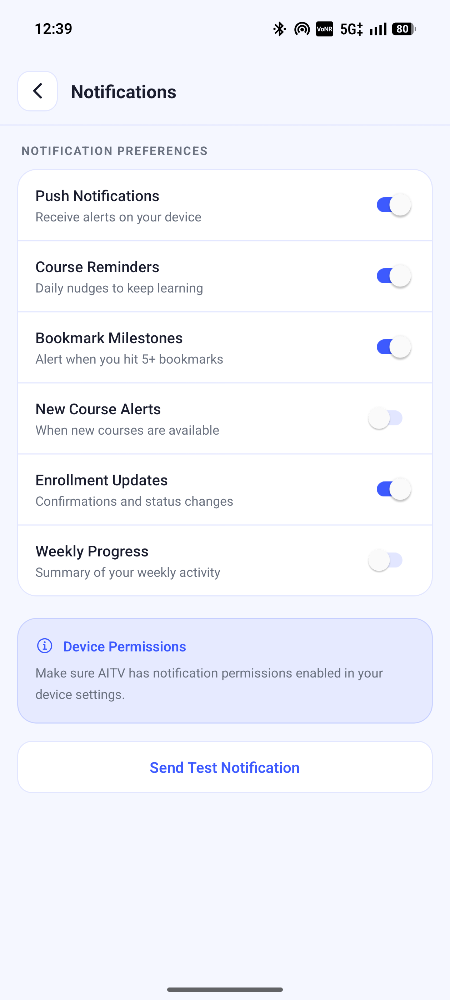 |

*Profile card shows username, email, enrolled count, bookmark count. Tap avatar → opens photo library directly (no intermediate dialog). Dark Mode toggle persists across app restarts. Edit Profile allows username update and password change with eye-toggle visibility.*

---

### Offline Mode

| Offline Banner | WebView Error |
|----------------|--------------|
| 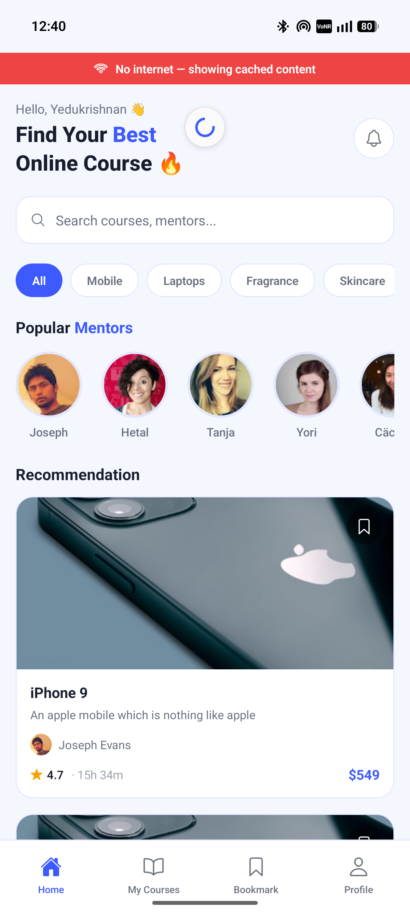 | 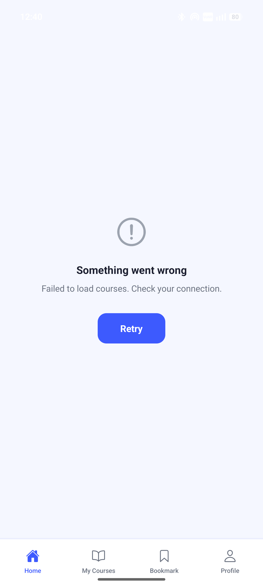 |

*Red banner appears at the top of every screen when the device has no internet. Cached courses remain visible. WebView shows a dedicated error screen with a Retry button when content fails to load.*

---

### Notifications

| Bookmark Milestone Notification | 24h Reminder |
|---------------------------------|-------------|
| 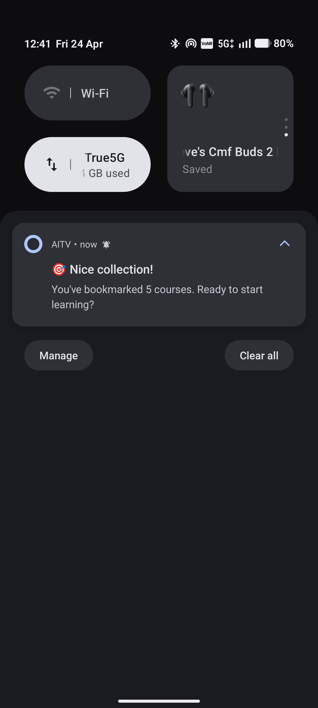 |  |

*System-level push notification fires immediately when user bookmarks their 5th course. A 24-hour reminder is scheduled when the app detects it hasn't been opened in a day.*

---

## Demo Video

<div align="center">

[](https://drive.google.com/file/d/1z8ZlAdNPL5zKS-FYKGXsqnB2OGT093-E/view?usp=drivesdk)

</div>

> **[▶ Watch Demo Video](https://drive.google.com/file/d/1z8ZlAdNPL5zKS-FYKGXsqnB2OGT093-E/view?usp=drivesdk)** — 3–5 minute walkthrough covering all features.

**What the demo covers:**
1. Register a new account
2. Browse and search courses
3. Enroll in a course and bookmark 5+ (triggers push notification)
4. Kill app and reopen → auto-login, data intact, no flash
5. WebView course content with native bridge communication
6. Go offline → banner appears, cached content still visible
7. Edit profile — change username, upload profile photo
8. Toggle dark/light theme
9. Logout → login as different user → separate bookmarks
10. Re-login as first user → original bookmarks restored

---

## Features

### Part 1 — Authentication & User Management

- **Register** via `POST /api/v1/users/register` — Zod validation, duplicate email detection with human-readable error
- **Login** via `POST /api/v1/users/login` — JWT access + refresh tokens stored in AsyncStorage
- **Auto-login on restart** — session restored silently, user lands directly on Home
- **Token refresh** — 401 interceptor in Axios automatically refreshes via `/api/v1/users/refresh-token`
- **Logout** — clears tokens and resets all course state
- **Profile update** — username edit with local fallback when API fails
- **Password change** — old/new/confirm password with inline validation
- **Profile photo** — opens device photo library directly, saves URI to AsyncStorage per user

### Part 2 — Course Catalog

- Courses sourced from `/api/v1/public/randomproducts` (course data) and `/api/v1/public/randomusers` (instructors)
- Course cards show: thumbnail, title, description, instructor avatar + name, rating, duration, price
- **Pull-to-refresh** using React Query's `refetch`
- **Real-time search** — filters by course title or instructor name, instant results
- **Category filter chips** — All, Mobile, Laptops, Fragrance, Skincare
- **Bookmark toggle** with immediate UI feedback and AsyncStorage persistence
- **Enroll flow** — loading state, confirmation alert, navigation to WebView

### Part 3 — WebView Integration

- Course content rendered in a fully custom HTML template inside `react-native-webview`
- **Native → WebView**: course data injected via JS (course ID, title, category, platform headers)
- **WebView → Native**: `window.ReactNativeWebView.postMessage()` for "Continue Learning" and "Back" actions
- WebView HTML adapts dynamically to dark/light theme (background, card, text colours all switch)
- Animated CSS progress bar, interactive module list, mentor card, star ratings in HTML

### Part 4 — Native Features

- Push notification **permissions requested** on first launch (physical device)
- **Bookmark milestone notification** — fires instantly when user reaches 5+ bookmarks
- **24-hour inactivity reminder** — scheduled when app detects it hasn't been opened in a day
- Android notification channel configured at `MAX` importance with vibration pattern

### Part 5 — State Management & Performance

- **Zustand** for auth, course, and theme state — minimal boilerplate, works outside React tree
- **Per-user data isolation** — bookmarks keyed as `aitv_bookmarks_<userId>`, enrolled as `aitv_enrolled_<userId>`
- **React Query** with 5-minute stale time and 3 automatic retries
- `CourseCard` wrapped in `React.memo` with custom equality — only re-renders when `bookmarked` or `enrolled` changes
- `FlatList` tuned: `removeClippedSubviews`, `maxToRenderPerBatch={6}`, `windowSize={5}`, `initialNumToRender={6}`
- Skeleton loading cards shown during initial fetch

### Part 6 — Error Handling

- **Exponential back-off retry** — up to 3 retries on network failure, delay scales per attempt
- **Offline banner** — `NetInfo` listener shows persistent red banner the moment connectivity drops
- **WebView error state** — failed loads show a retry screen, not a blank white page
- **API error extraction** — response body message surfaced to user in plain language
- **Safe storage wrappers** — all SecureStore/AsyncStorage calls wrapped in try/catch, never crashes on bad values
- **Duplicate email** — register screen shows "This email is already registered. Please sign in instead."

---

## Architecture

```
aitv-lms/
├── app/
│   ├── _layout.tsx              # Root — loads theme + session in parallel, no flash
│   ├── index.tsx                # Entry redirect based on auth state
│   ├── (auth)/
│   │   ├── _layout.tsx          # Auth stack layout
│   │   ├── login.tsx            # Login screen
│   │   └── register.tsx         # Register screen
│   ├── (tabs)/
│   │   ├── _layout.tsx          # Bottom tab bar — Home, Bookmark, MyCourses, Profile
│   │   ├── index.tsx            # Home screen — search, filter, course list
│   │   ├── bookmarks.tsx        # Bookmarks screen — user's saved courses
│   │   ├── mycourses.tsx        # Enrolled courses screen
│   │   └── profile.tsx          # Profile screen — settings, dark mode, logout
│   ├── course/
│   │   └── [id].tsx             # Course detail — About / Lessons / Discussions tabs
│   ├── webview/
│   │   └── [id].tsx             # WebView — themed HTML course content
│   └── profile/
│       ├── settings.tsx         # Edit username + change password
│       ├── notifications.tsx    # Notification preferences
│       ├── help.tsx             # FAQ accordion
│       ├── privacy.tsx          # Privacy policy
│       └── my-courses.tsx       # Enrolled courses (from profile navigation)
├── components/
│   ├── course/
│   │   ├── CourseCard.tsx       # Memoized course card with bookmark toggle
│   │   └── CourseCardSkeleton.tsx # Animated shimmer loading state
│   └── ui/
│       ├── OfflineBanner.tsx    # Red offline indicator
│       ├── ErrorView.tsx        # Full-screen error + retry
│       └── ContinueLessons.tsx  # "Continue your lessons" banner on Home
├── store/
│   ├── authStore.ts             # Zustand — session, login/register/logout/restore
│   ├── courseStore.ts           # Zustand — courses, bookmarks, enrolled (per-user keyed)
│   └── themeStore.ts            # Zustand — isDark flag + light/dark theme token objects
├── hooks/
│   ├── useCourses.ts            # React Query fetch → courseStore sync (no race condition)
│   ├── useNotifications.ts      # Expo Notifications — permissions, bookmark milestone, reminder
│   ├── useNetwork.ts            # NetInfo — real-time offline detection
│   └── useTheme.ts              # Selector — returns current theme token object
├── lib/
│   ├── api.ts                   # Axios — auth interceptor, 401 refresh, retry, error extraction
│   ├── courseAdapter.ts         # Maps randomproducts + randomusers → Course[] interface
│   ├── secureStorage.ts         # AsyncStorage typed helpers
│   ├── storage.ts               # Additional storage utilities
│   └── notifications.ts        # Notification helper functions
├── types/
│   └── index.ts                 # All TypeScript interfaces — User, Course, Instructor, etc.
├── constants/
│   └── index.ts                 # API_BASE_URL, STORAGE_KEYS, QUERY_KEYS, NOTIFICATION_IDS
├── store/
│   └── themeStore.ts            # Light theme (#F5F7FF bg) + Dark theme (#12141C bg) tokens
└── assets/
    ├── icon.png
    ├── splash.png
    ├── adaptive-icon.png
    └── screenshots/             # All screen captures referenced in this README
```

---

## Tech Stack

| Layer | Library | Version | Purpose |
|-------|---------|---------|---------|
| Framework | React Native + Expo | SDK 54 / RN 0.81.5 | Cross-platform mobile foundation |
| Language | TypeScript | 5.9 strict | Type safety throughout |
| Navigation | Expo Router | 6.0 | File-based routing, deep links |
| Styling | NativeWind | 4.0 | Tailwind utility classes for RN |
| State | Zustand | 4.5 | Lightweight global state, works outside React |
| API + Cache | Axios + TanStack React Query | 1.7 + 5.56 | HTTP client with interceptors + server state caching |
| App data | AsyncStorage | 2.2 | Bookmarks, enrolled, user profile, theme |
| Secure data | Expo SecureStore | 15.0 | Auth tokens (Keychain/Keystore) |
| Forms | React Hook Form + Zod | 7.53 + 3.23 | Performant forms with schema validation |
| Notifications | Expo Notifications | 0.32 | Local push, permissions, scheduling |
| WebView | react-native-webview | 13.15 | Embedded course content with JS bridge |
| Image Picker | expo-image-picker | 17.0 | Profile photo selection |
| Network | @react-native-community/netinfo | 11.4 | Real-time connectivity monitoring |
| Icons | Ionicons via @expo/vector-icons | bundled | All UI icons, no emoji |
| Gestures | react-native-gesture-handler | 2.28 | Swipe, tap gesture foundation |

---

## Setup Instructions

### Prerequisites

| Tool | Version |
|------|---------|
| Node.js | 18+ |
| npm | 9+ |
| Expo CLI | latest (`npm i -g expo-cli`) |
| EAS CLI | latest (`npm i -g eas-cli`) — for APK builds only |
| Android Studio | Flamingo+ — for local Android builds only |
| Xcode | 15+ (Mac only) — for iOS builds only |

### Step 1 — Clone the repository

```bash
git clone https://github.com/YOUR_USERNAME/aitv-lms.git
cd aitv-lms
```

### Step 2 — Install dependencies

```bash
npm install
npx expo install expo-image-picker
```

### Step 3 — Run the app

```bash
# Start Expo development server
npm start

# Open on Android emulator or connected device
npm run android

# Open on iOS simulator (Mac only)
npm run ios
```

> **Note:** For push notifications to work, you must run on a **physical device** — simulators do not support local notifications.

### Step 4 — Create an account

Register a new account through the app. The API server at `https://api.freeapi.app` handles all user management — no local backend needed.

---

## Environment Variables

**No `.env` file is required.** The API base URL is hardcoded in `constants/index.ts`:

```typescript
export const API_BASE_URL = 'https://api.freeapi.app';
```

If you need to point to a different API server, change this single value. All endpoints in `lib/api.ts` and `store/authStore.ts` reference this constant.

---

## Key Architectural Decisions

### 1. Per-user data isolation
```typescript
// courseStore.ts
const getUserBookmarksKey = (userId: string) => `aitv_bookmarks_${userId}`;
const getUserEnrolledKey  = (userId: string) => `aitv_enrolled_${userId}`;
```
Bookmarks and enrolled courses are stored under user-specific AsyncStorage keys. Two users sharing one device never see each other's data. Logout clears in-memory state; the persisted data for each user remains for when they log back in.

---

### 2. Race-condition-free session restore
```typescript
// authStore.ts — restoreSession
await loadCourseDataForUser(userId);   // Load bookmarks/enrolled FIRST
set({ isAuthenticated: true, ... });   // THEN mark as authenticated
```
Course data is loaded before `isAuthenticated` is set to `true`. This means by the time the home screen renders, bookmarks and enrolled status are already in the store — no second render needed, no stale state.

---

### 3. Theme + session loaded in parallel, zero flash
```typescript
// app/_layout.tsx
Promise.all([loadTheme(), restoreSession()]).finally(() => setReady(true));
```
Both the theme preference and the user session are resolved simultaneously. Nothing renders until both complete — eliminating the white-to-dark or dark-to-white colour flash on app reopen.

---

### 4. Circular dependency avoided in stores
```typescript
// authStore.ts
const { useCourseStore } = await import('./courseStore');  // dynamic import
```
`authStore` needs to call `courseStore` after login, but `courseStore` must not import `authStore` (circular). Solved with a dynamic `import()` — only executed at runtime when needed, never at module parse time.

---

### 5. Memoized list items with correct equality
```typescript
// CourseCard.tsx
export const CourseCard = memo(function CourseCard(...) {
  ...
}, (prev, next) => (
  prev.course.id === next.course.id &&
  prev.course.bookmarked === next.course.bookmarked &&
  prev.course.enrolled === next.course.enrolled
));
```
Default `memo` re-renders whenever the `course` object reference changes (which happens on every store update). The custom equality function checks only the fields that affect visual output — bookmark and enroll state — preventing unnecessary re-renders of the entire list.

---

### 6. API error messages surfaced to the user
```typescript
// lib/api.ts — response interceptor
const apiMessage =
  (error.response?.data as { message?: string })?.message ||
  (error.response?.data as { error?: string })?.error;
if (apiMessage) return Promise.reject(new Error(apiMessage));
```
The API response body `message` field is extracted and thrown as a proper `Error` object. Components catch it and display the exact server message (e.g., "User already exists") translated into plain language.

---

## API Reference

| Endpoint | Method | Auth | Purpose |
|----------|--------|------|---------|
| `/api/v1/users/register` | POST | None | Create account |
| `/api/v1/users/login` | POST | None | Get access + refresh tokens |
| `/api/v1/users/logout` | POST | Bearer | Invalidate session |
| `/api/v1/users/refresh-token` | POST | None | Rotate tokens silently |
| `/api/v1/users/update-profile` | PATCH | Bearer | Update username |
| `/api/v1/users/change-password` | POST | Bearer | Change password |
| `/api/v1/public/randomproducts` | GET | None | Course catalogue (20 items) |
| `/api/v1/public/randomusers` | GET | None | Instructor profiles (20 items) |

---

## Known Issues & Limitations

| Issue | Detail |
|-------|--------|
| **Bookmarks lost on reinstall** | AsyncStorage is wiped on app uninstall. Data is local-only, not server-synced. Expected device behaviour. |
| **Randomised course data** | FreeAPI returns random data on each fetch. Course IDs are stable within a session but titles and thumbnails change between cold starts if cache is cleared. |
| **No real video player** | Course content is a static HTML page in WebView. No video streaming is implemented. |
| **Profile photo is local only** | Photo URI stored in AsyncStorage — not uploaded to a server. Lost on reinstall. |
| **Notifications require physical device** | Expo Notifications does not work in the iOS/Android simulator — use a real device for this feature. |
| **iOS notifications need Dev account** | Production iOS push notifications require an Apple Developer membership and provisioning profile. |

---

## Build Instructions

### Development APK (Android)

```bash
# Option 1 — EAS Build (no local SDK required)
eas login
eas build --platform android --profile preview
# Download APK link appears in terminal when complete (~5-10 min)

# Option 2 — Local build
npx expo prebuild --platform android
cd android && ./gradlew assembleDebug
# APK at: android/app/build/outputs/apk/debug/app-debug.apk
```

### iOS Build

```bash
# Simulator (Mac only, no Apple account needed)
npx expo run:ios

# Physical device / TestFlight (Apple Developer account required)
eas build --platform ios
```

### Install APK on Android device

```bash
# Via ADB (USB debugging enabled)
adb install app-debug.apk

# Or transfer APK to phone storage and open the file to install
# (Enable "Install from unknown sources" in device settings first)
```

See [BUILD_APK.md](BUILD_APK.md) for the complete step-by-step build guide.

---

## Assignment Coverage

| Requirement | Status | Implementation |
|-------------|--------|---------------|
| Login / Register via `/api/v1/users` | ✅ | `store/authStore.ts`, `app/(auth)/login.tsx`, `register.tsx` |
| Store tokens with SecureStore | ✅ | `lib/api.ts` — safe wrappers, `store/authStore.ts` |
| Auto-login on restart | ✅ | `restoreSession()` in `app/_layout.tsx` on mount |
| Logout | ✅ | Clears tokens + course state |
| Token refresh | ✅ | 401 interceptor in `lib/api.ts` |
| Profile screen with stats | ✅ | `app/(tabs)/profile.tsx` |
| Profile picture update | ✅ | `expo-image-picker`, stored per user |
| Course list from randomproducts + randomusers | ✅ | `lib/courseAdapter.ts`, `hooks/useCourses.ts` |
| Thumbnail, instructor, title, description, bookmark | ✅ | `components/course/CourseCard.tsx` |
| Pull-to-refresh | ✅ | React Query `refetch` + `RefreshControl` |
| Search functionality | ✅ | Client-side filter in `app/(tabs)/index.tsx` |
| Course detail screen | ✅ | `app/course/[id].tsx` — 3 tabs |
| Enroll button with feedback | ✅ | Loading state, confirmation alert |
| Bookmark toggle with local storage | ✅ | Per-user AsyncStorage keys |
| WebView embedded content | ✅ | `app/webview/[id].tsx` |
| Native → WebView communication | ✅ | JS injection with course headers |
| WebView → Native communication | ✅ | `postMessage` handled in `onMessage` |
| Local notification permissions | ✅ | `hooks/useNotifications.ts` |
| Bookmark 5+ notification | ✅ | Fires immediately at milestone |
| 24-hour reminder notification | ✅ | Scheduled via `LAST_OPENED` timestamp |
| Global state management | ✅ | Zustand — auth, course, theme stores |
| FlatList optimisation | ✅ | `memo`, `keyExtractor`, `removeClippedSubviews` |
| Pull-to-refresh without jank | ✅ | React Query `isFetching` + `RefreshControl` |
| API retry mechanism | ✅ | Exponential back-off, 3 retries |
| Offline mode banner | ✅ | `NetInfo` + `OfflineBanner` component |
| WebView error handling | ✅ | `onError` → retry screen |
| TypeScript strict mode | ✅ | `tsconfig.json` — `"strict": true` |
| Dark mode | ✅ | Full theme system, persisted, zero flash |
| Form validation (Zod) | ✅ | All forms — login, register, settings |

---

<div align="center">

Built with React Native Expo · TypeScript · Zustand · NativeWind

</div>
